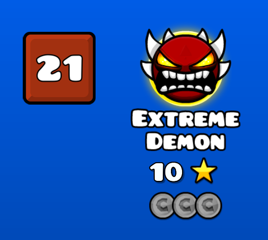

# <cr> GDDL Integration </c>

Displays <cr>**GDDL tiers**</c> below demon ratings.

If there's no rating yet, it'll display a sad face :(  
If the rating doesn't load, <cb>refresh</c> the level page.

## Known issues

- <cg>Usernames</c> sometimes turn into <cy>`-`</c> after a <cr>failed</c> request, this is just cosmetic though

If you encounter any other issues, contact me on Discord (<cb>@b1rtek</c>)