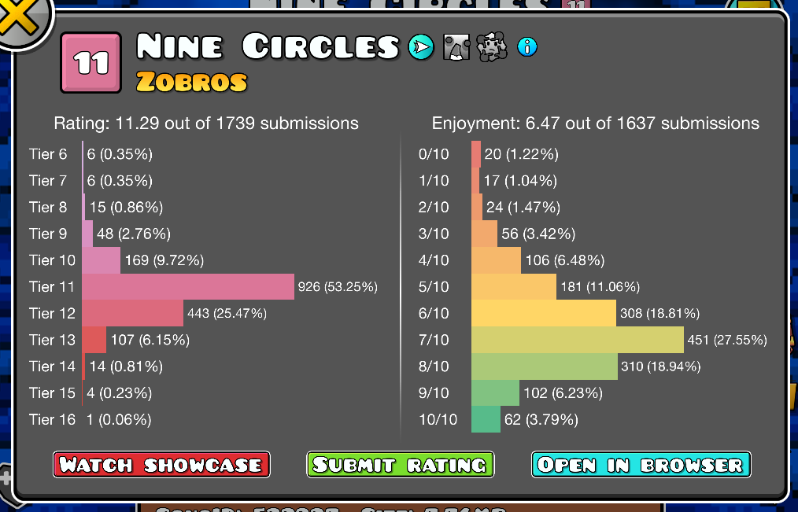
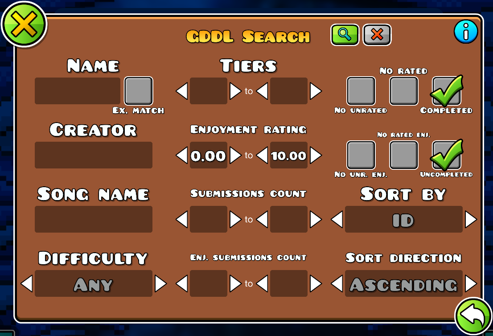

# <cr> GDDL Integration </c>
Integration with [Geometry Dash Demon Ladder](https://gdladder.com/)  
GDDL Discord server: https://discord.gg/gddl

## Features
- Displays <cr>GDDL ratings</c> of demon levels, rating and enjoyment distributions, skillsets and more!
- Allows for rating levels on GDDL straight from the game!
  - This requires logging in to your GDDL account, you can do that in the mod's settings
- Includes a <cy>superior to Rob's</c> demon searching UI - allowing to search by a part of the level name, GDDL tiers <co>and more!</c>
- Adds a <cr>GDDL Tier Split</c> page showing how many levels of which tier you've completed, click on the tier labels to see the completed levels

**<cy>Positions of UI elements can be adjusted in the settings, be sure to visit them if one of your other mods overlaps UI elements with this one</c>**

## Known issues
If you encounter an <cy>issue</c> with the mod, [open an issue in the mod's GitHub repo](https://github.com/B1rtek/Geode-GDDLIntegration/issues/new/choose) or contact me on Discord (<cb>@b1rtek</c>)
- <cy>Usernames</c> sometimes turn into <cy>`-`</c> after a <cr>failed</c> request, this is just cosmetic though ([apparently Rob's fault](https://github.com/geode-sdk/indexer/issues/557#issuecomment-1913375319))
- Opening the *GDDL Demon Split* popup <co>might</c> cause a lag, don't worry about that :)
- The level browser <co>might</c> display a button which should allow you to go to the next page of results even though there might be no more pages

## Special thanks

<cb>*Code contributions:*</c> <cy>**[Diver](https://github.com/B1rtek/Geode-GDDLIntegration/pull/3)[sion](https://github.com/B1rtek/Geode-GDDLIntegration/pull/88), [dankmeme01](https://github.com/dankmeme01) (<3)**</c>  
<cg>*Feature suggestions:*</c> <cy>[MasterGamerY](https://github.com/B1rtek/Geode-GDDLIntegration/issues/1), [Weebifying](https://github.com/B1rtek/Geode-GDDLIntegration/pull/2), [averiee_](https://github.com/B1rtek/Geode-GDDLIntegration/milestone/4), [TheSuperJepphyKiller](https://github.com/B1rtek/Geode-GDDLIntegration/issues/6), [hoshinekosanti](https://github.com/B1rtek/Geode-GDDLIntegration/issues/11),  [epicmushroom.](https://github.com/B1rtek/Geode-GDDLIntegration/issues/15), [Koble](https://github.com/B1rtek/Geode-GDDLIntegration/issues/21), [Diversion](https://github.com/B1rtek/Geode-GDDLIntegration/issues/25), [peteratomic](https://github.com/B1rtek/Geode-GDDLIntegration/issues/34), [ninXout](https://github.com/B1rtek/Geode-GDDLIntegration/pull/61), [itzgabrix](https://github.com/B1rtek/Geode-GDDLIntegration/issues/45), [FRBFStudios](https://github.com/B1rtek/Geode-GDDLIntegration/issues/74)</c>  
<cy>*Problem solving:*</c> <cy>hiimjasmine00, thesillydoggo</c>  
<cr>*Bug reporters:*</c> <cy>croozington, bllue, [Fleeym](https://github.com/geode-sdk/indexer/issues/557#issuecomment-1913780380), [matcool](https://github.com/geode-sdk/indexer/issues/557#issuecomment-1913780699), [Lexicon](https://github.com/B1rtek/Geode-GDDLIntegration/issues/7), [patrick61804](https://github.com/B1rtek/Geode-GDDLIntegration/issues/16), [epicmushroom.](https://github.com/B1rtek/Geode-GDDLIntegration/issues/20), [GlassesCatandsteve](https://github.com/B1rtek/Geode-GDDLIntegration/issues/27), [HotKentang, wangko5383, dshifter, Ev212](https://github.com/B1rtek/Geode-GDDLIntegration/issues/29), Cvolton, [pointedbowl](https://github.com/B1rtek/Geode-GDDLIntegration/issues/33), [Neonyx27, ItzGabrix](https://github.com/B1rtek/Geode-GDDLIntegration/issues/40), [Aktimoose](https://github.com/B1rtek/Geode-GDDLIntegration/issues/46), [MasterGamerY, Denyscrasav4ik, rynethegrynd](https://github.com/B1rtek/Geode-GDDLIntegration/issues/49), [ZorTik](https://github.com/B1rtek/Geode-GDDLIntegration/issues/50), [ZorTik, zHackro, powerz](https://github.com/B1rtek/Geode-GDDLIntegration/issues/58), 7w7y, [Cosmella-v](https://github.com/B1rtek/Geode-GDDLIntegration/issues/75), [calum12345](https://github.com/B1rtek/Geode-GDDLIntegration/issues/80), lyaten, just_dark_, supersquad33</c>
